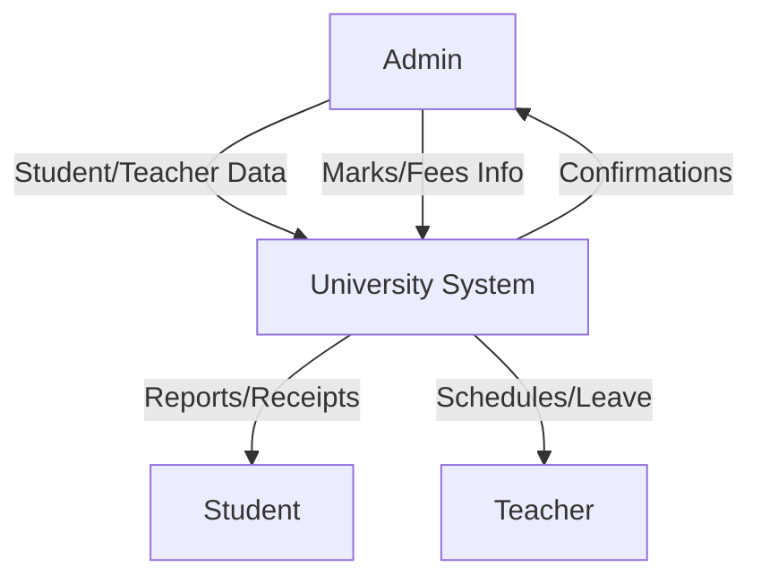
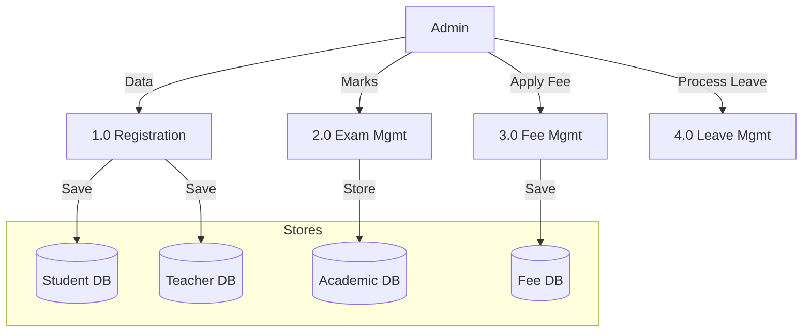
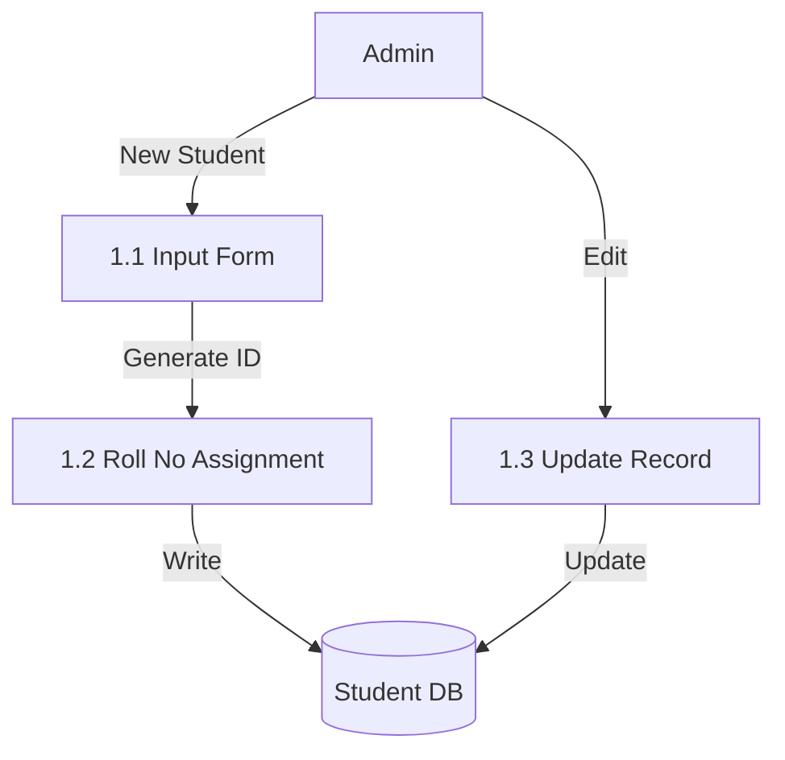

# University Management System - DFD Diagrams

This document summarizes the DFDs created for the University Management System. Images have been saved in the project directory under the `dfd diagrams` folder.

## Level 0: Context Diagram
A high-level view showing the Admin interacting with the University Management System.

---

## Level 1: Functional DFD
Breaking down the system into core modules like Login, Student/Teacher Profiles, Academics, Fees, and Leave.

---

## Level 2: Student Management
Detailed view of the student registration and update process.

> [!TIP]
> All diagrams are also available as PNG files in the project folder: [dfd diagrams](file:///d:/University-main/dfd%20diagrams)
